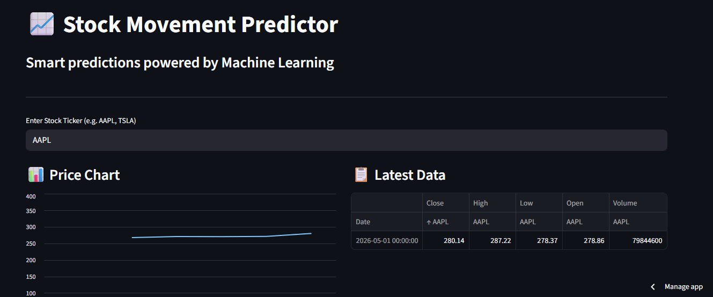

📈 Stock Movement Predictor App

A machine learning web application that predicts whether a stock price will go **UP 📈 or DOWN 📉** based on real-time market data.

---

🚀 Live Demo
👉 https://Stock-Predictor-App.streamlit.app

---

 🧠 Project Overview

This project uses a **Random Forest Classifier** trained on stock price features to predict next-day movement.

Users can:
- Enter any stock ticker (e.g., AAPL, TSLA)
- View recent stock data
- See a prediction with confidence score

---
 ⚙️ Tech Stack

- Python
- Streamlit
- Scikit-learn
- NumPy
- yFinance

---

 📊 Features

✔ Real-time stock data  
✔ Interactive chart  
✔ Clean UI layout  
✔ Prediction with confidence score  

---

 🧩 How It Works

1. Fetch stock data using yFinance  
2. Extract key features:
   - Open
   - High
   - Low
   - Volume  
3. Feed into trained ML model  
4. Display prediction

---

 📁 Project Structure

 
---

## 💡 Future Improvements

- Add more features (technical indicators)
- Improve model accuracy
- Add historical prediction tracking

📸 App Preview

---

 👩‍💻 Author

Built by **DELIGHT NELSON**
